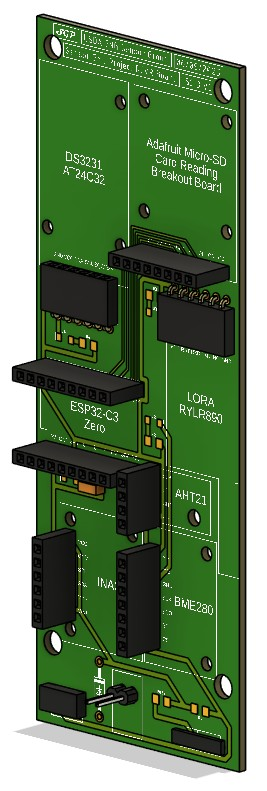
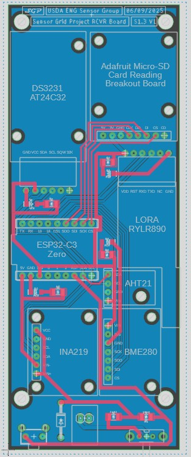
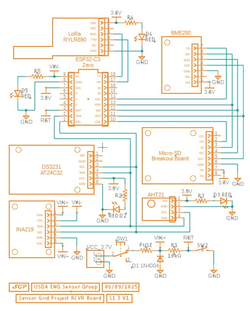

# ESP32 Environmental Sensor System

## Overview
This project is an embedded environmental sensing system built around the ESP32-C3 Zero.
It was developed as part of undergraduate research and is designed to collect environmental
data using multiple sensors while supporting low-power operation, timing control, and
modular code organization.

## Application
This system is designed for long-term environmental monitoring in remote or low-power
deployments where reliable data collection and synchronization are critical.

## Project Goals
- Collect environmental sensor data reliably
- Support low-power operation using deep sleep
- Maintain accurate timing using an external RTC
- Enable modular and maintainable embedded code
- Prepare the system for wireless communication and data logging

## System Architecture
The system is built around an ESP32-C3 Zero microcontroller that interfaces with multiple
environmental sensors and an external DS3231 RTC for accurate timekeeping. Sensor data is
collected at scheduled intervals, synchronized using the RTC, and either logged locally to
a micro-SD card or transmitted via LoRa point-to-point communication. The system leverages
deep sleep cycles to minimize power consumption for long-term battery-powered deployments.

## Hardware Design

### 3D PCB Model

### PCB Layout

### Schematic

## Features
- Embedded system with a modular design
- Power management for battery powered deployments
- Power conservation by using deep sleep
- Time synchronization using external RTC
- Wireless communication using LoRa point-to-point
- Micro-SD data logging

## Hardware Used
- ESP32-C3 Zero
- DS3231 RTC
- AHT21
- BME280
- Seesaw soil sensor
- INA219
- Micro-SD card module
- LoRa module

## Software
- Arduino IDE (C++ embedded development)
- Sensor and RTC interface libraries
- Autodesk Fusion (PCB and mechanical design)

## Engineering Challenges
- Managing deep sleep wake timing accurately
- Correcting drift between wake cycles and logging intervals
- Configuring the system for long-term battery-powered field use
- Designing a dense PCB within the parameters of a deployable enclosure.

## Documentation
Additional documentation is available in the `docs/` folder:

- ESP32 vs Raspberry Pi Pico comparison
- PCB module specifications with dimensions and datasheet references
- Environmental data log (CSV format)

## Repository Structure
- `src/` — source code
- `docs/` — project documentation and notes
- `images/` — project photos and diagrams

## Future Improvements
- Add clearer wiring and system diagrams
- Improve documentation for setup and deployment
- Add power consumption measurements
- Expand wireless communication and remote logging features

## Author
Steven Pilgrim
Computer Engineering Student, NDSU
